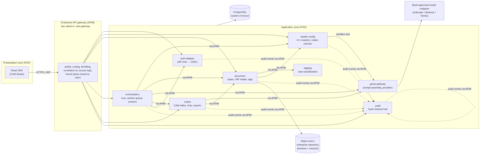

# CAM Platform — Solution Architecture (v1)

Companion to the BRD ("AI-Assisted Credit Assessment Memo Generation Platform")
and to [contracts.md](contracts.md) (API surface) and
[traceability.md](traceability.md) (requirement → implementation map).
Decisions with alternatives are recorded in [adr/](adr/).

## 1. Context

Analysts assemble borrower documents, the platform drafts a CAM section-by-
section from business-administered masters (prompts, KPIs, templates, document
types), and the analyst reviews, edits, converses with the AI and finalises.
Generation logic lives in masters, not code — the bank evolves the product
without vendor releases. Everything is auditable end-to-end.

## 2. Component view

Rules of the topology (NFR-04/NFR-10):

* No point-to-point service calls — every arrow above traverses the gateway,
  which is the local stand-in for the bank's APIM (same policies: authN,
  throttling, logging, correlation).
* The GenAI plane (`/api/genai`) accepts **service identities only**; the
  gateway additionally rejects end-user tokens at the edge. The front-end can
  never reach a model endpoint.
* Document binaries and text extracts live in blob storage, never in the
  database (NFR-03).

## 3. The generation flow (FR-D01…D05)

1. **Resolve** — orchestration asks master-config for the published template
   bundle: ordered sections → published section prompts → global standing
   rules → referenced document-type versions, plus the industry's published
   KPI set. Anything unpublished refuses with `not_published` (only approved
   configuration can generate).
2. **Snapshot** — the run row freezes every master version, the applied
   preference profile, gaps against the required-document set, and the full
   resolved bundle. Reproducibility does not depend on masters staying still.
3. **Queue** — one `SectionJob` row per template section (DB-backed queue,
   ADR-0004). Conditional sections without their trigger document are marked
   `skipped` with a reason.
4. **Execute** — asyncio workers claim jobs; for each section they fetch ONLY
   its mapped documents' text (FR-D03), render `{{placeholders}}` and the
   section-scoped `{{industry_kpis}}` block (FR-A11), and call the GenAI
   gateway with the three prompt layers (house rules → global standing rules →
   template instructions → section prompt) and the style directives derived
   from the preference profile (suppressed for fixed-format sections, FR-B04).
5. **Check** — the GenAI gateway extracts numeric/date tokens from the draft
   and flags anything untraceable to the grounding material (FR-D04). Flags
   travel with the section into the run record and the trailer.
6. **Deliver** — when all sections are terminal, orchestration posts the CAM
   to the output service with a generated **data-gap trailer** (`_gaps`)
   disclosing missing documents, skipped/failed sections and flagged figures
   (FR-D05), then emits `run.completed` carrying the whole run record.

Failures stay section-local: `failed` sections are retryable individually;
`regenerate` clones a job and lands the new draft as a fresh version of that
section only (FR-D06).

## 4. Human-in-the-loop editing (FR-E0x)

The output service owns the working copy: per-section versions (autosave
coalescing + named versions + diffs + optimistic locking), a conversational
panel whose section-scoped replies always land as **pending suggestions** with
a diff — accepted or rejected explicitly, never auto-applied (FR-E06) — and
in-chat uploads that pass through the same VAF + auto-tagging pipeline before
becoming grounding (FR-E05). Finalisation is blocked while any suggestion is
pending; exports carry an "AI-ASSISTED DRAFT" watermark until final (FR-E08).

## 5. Security model

| Concern | Mechanism |
|---|---|
| Identity | Dev IdP stub issuing short-lived HS256 JWTs; production swaps the auth-adapter for the bank IdP (OIDC/SAML) — one service, no other changes |
| Authorisation | Single role→capability matrix (`cam/common/rbac.py`, transcribed from BRD §4) enforced in every service; analysts own-scoped |
| Service-to-service | Short-lived service tokens (`typ=service`), minted per call, vault-backed secret in production |
| Secrets | Env/vault only; never in code, responses, or logs; login responses carry no credential material (verified in AC-5) |
| Prompt injection | Document text is sanitised and wrapped in inert `<document>` data blocks; standing rule 3 instructs the model that documents are data; instruction-like content cannot override system layers (NFR-09) |
| Malware | VAF pipeline: validation → AV scan (EICAR stub at the ICAP integration point) → quarantine with visible reason; quarantined content is never stored or used |
| Tamper evidence | Audit events are hash-chained (`sha256(prev_hash + canonical(event))`) with a `verify-chain` endpoint |

## 6. Observability (NFR-11)

The gateway mints `X-Correlation-ID`; every service adopts it (contextvar +
middleware), forwards it on outbound calls, stamps it on audit events, and the
run record stores it — one id spans upload → generation → edit → export.
Gateway access logs carry method, path, status, latency, principal and
correlation id. Centralised log/metric shipping is a deployment concern noted
in the traceability matrix.

## 7. Deployment

* **Local dev**: `scripts/run_stack.py` — 9 uvicorn processes, SQLite, local
  blob dirs, mock LLM. Zero external dependencies.
* **Containerised**: `docker-compose.yml` — PostgreSQL 16 + one image with a
  per-container `SERVICE_MODULE` (ADR-0001), gateway on :8080, volumes for
  data. Generation workers scale horizontally by scaling the orchestration
  container (queue claims are safe under `FOR UPDATE SKIP LOCKED` semantics on
  PostgreSQL).
* **Bank target**: services behind the real APIM; bank IdP; enterprise
  document repository behind the storage adapter; approved LLM endpoint
  (Anthropic API / Bedrock / Vertex) configured in the GenAI gateway; RTO/RPO
  and sizing per the bank's NFR standards (pending input, NFR-13).

## 8. What v1 deliberately defers

Rich-text (WYSIWYG) editing (markdown editor shipped instead), OCR for scanned
documents (extraction status is surfaced; OCR engine is an integration point),
one-pager summary export, usage dashboard UI (API exists), formal MRM workflow
(sampling endpoint + versioned artifacts exist). Full list with pointers:
[traceability.md](traceability.md).
