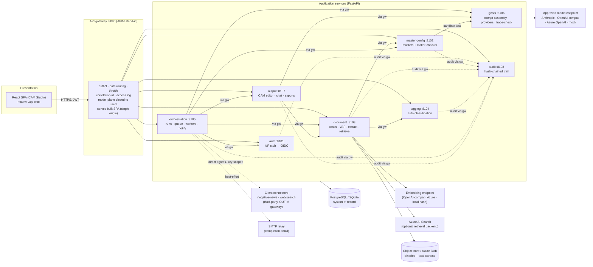
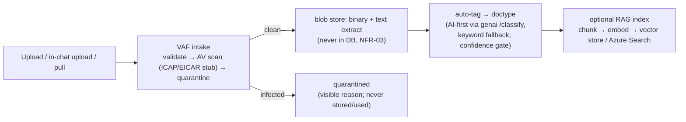
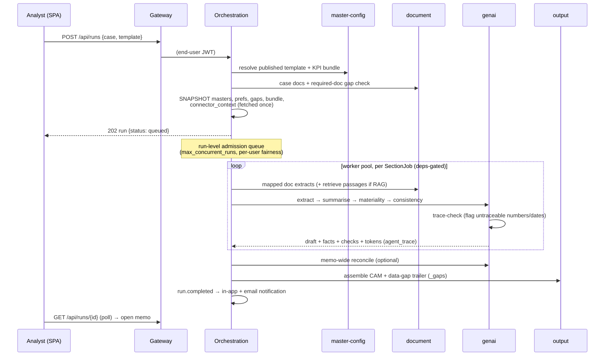
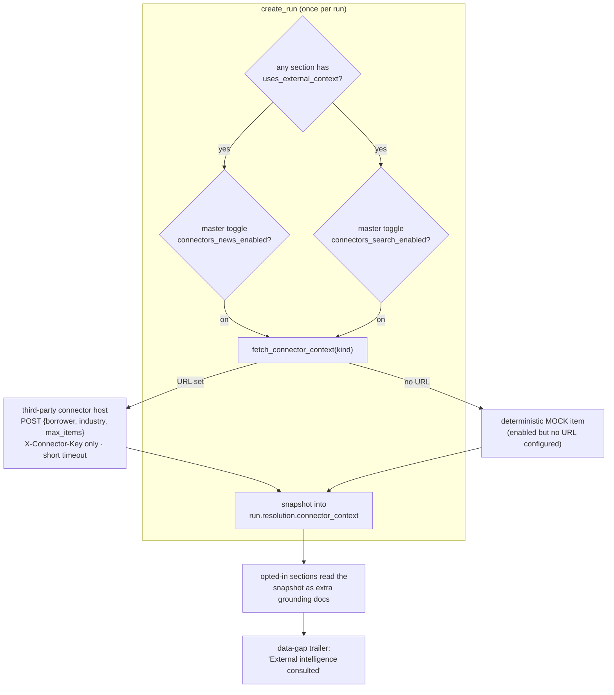

# CAM Platform — Detailed Technical Architecture (v2)

AI-Assisted Credit Assessment Memo (CAM) generation platform. Companion to the
BRD, to [contracts.md](contracts.md) (full API surface), and
[traceability.md](traceability.md) (requirement → implementation). Design
decisions with alternatives are in [adr/](adr/).

> **One-line mental model.** A React SPA talks to a single API gateway, which
> fronts nine small FastAPI services. Business logic (prompts, KPIs, templates,
> document types) lives in *versioned masters*, not in code. A run resolves and
> **snapshots** those masters, queues one job per memo section, and a worker pool
> drives a four-agent LLM pipeline per section through a locked-down GenAI
> gateway — grounded on the case's own documents plus optional retrieval (RAG)
> and optional external **connectors** — then assembles the memo with a data-gap
> trailer and hands it to an editor/export service. Everything is snapshotted,
> hash-chain audited, and correlation-id traced end to end.

---

## 1. Principles

1. **Configuration over code (FR-A\*).** Generation behaviour is authored by
   business admins as masters and evolves without a vendor release.
2. **Everything through the gateway (NFR-04).** No point-to-point service calls;
   the gateway is the local stand-in for the bank's APIM and carries the same
   policies (authN, throttling, correlation, access logs).
3. **The model plane is closed (NFR-10).** Only service identities may reach
   `/api/genai`; the gateway rejects end-user tokens at the edge. The SPA can
   never reach a model endpoint.
4. **Reproducibility by snapshot.** A run freezes every master version, the
   preference profile, the resolved bundle, and any external context — replaying
   a run does not depend on masters staying still.
5. **Grounded, not fabricated (FR-D03/D04).** Sections are drafted only from
   attributed source facts; a deterministic backstop flags any number/date that
   cannot be traced to supplied material.
6. **Fail-open at the edges, fail-safe at the core.** Optional subsystems
   (connectors, RAG, email, master-config lookups) degrade gracefully and never
   break a run; security gates (auth, model-plane closure) fail closed.
7. **Auditable end to end.** Hash-chained audit events + one correlation id from
   upload → generation → edit → export.

---

## 2. Component & topology view

```mermaid
flowchart LR
    subgraph POP["Presentation"]
        FE["React SPA (CAM Studio)<br/>relative /api calls"]
    end
    subgraph EDGE["API gateway :8080 (APIM stand-in)"]
        GW["authN · path routing · throttle<br/>correlation-id · access log<br/>model-plane closed to users<br/>serves built SPA (single origin)"]
    end
    subgraph POD["Application services (FastAPI)"]
        AUTH["auth :8101<br/>IdP stub → OIDC"]
        MC["master-config :8102<br/>masters + maker-checker"]
        DOC["document :8103<br/>cases · VAF · extract · retrieve"]
        TAG["tagging :8104<br/>auto-classification"]
        ORCH["orchestration :8105<br/>runs · queue · workers · notify"]
        GENAI["genai :8106<br/>prompt assembly · providers · trace-check"]
        OUT["output :8107<br/>CAM editor · chat · exports"]
        AUD["audit :8108<br/>hash-chained trail"]
    end
    LLM["Approved model endpoint<br/>Anthropic · OpenAI-compat · Azure OpenAI · mock"]
    EMB["Embedding endpoint<br/>(OpenAI-compat · Azure · local hash)"]
    SEARCH["Azure AI Search<br/>(optional retrieval backend)"]
    CONN["Client connectors<br/>negative-news · web/search<br/>(third-party, OUT of gateway)"]
    SMTP["SMTP relay<br/>(completion email)"]
    PG[("PostgreSQL / SQLite<br/>system of record")]
    BLOB[("Object store / Azure Blob<br/>binaries + text extracts")]

    FE -->|HTTPS, JWT| GW
    GW --> AUTH & MC & DOC & TAG & ORCH & OUT & AUD
    DOC -->|via gw| TAG & MC
    ORCH -->|via gw| MC & DOC & GENAI & OUT & AUTH
    OUT -->|via gw| GENAI & DOC
    MC -->|sandbox test| GENAI
    GENAI --> LLM
    DOC --> EMB & SEARCH
    ORCH -. "direct egress, key-scoped" .-> CONN
    ORCH -. "best-effort" .-> SMTP
    POD --> PG
    DOC --> BLOB
    AUTH & MC & DOC & TAG & ORCH & OUT -. audit via gw .-> AUD
```

Ports are the local-dev layout (`scripts/run_stack.py`); in containers each
service is the same image with a per-container `SERVICE_MODULE` (ADR-0001) and
the gateway routes by env (`CAM_ROUTE_*`). The SPA uses **relative `/api` paths**,
so when the gateway serves the built `frontend/dist` the whole app is one origin.

### The five planes

The arrows above belong to five distinct planes, each with its own trust and
egress rules — this separation is the backbone of the security model:

| Plane | Who initiates | Path | Auth carried | Egress |
|---|---|---|---|---|
| **Control** | SPA → services | via gateway | end-user JWT | internal |
| **Model** | services → genai | via gateway | **service token only** | genai → LLM |
| **Retrieval** | document svc | direct to embed/search backend | backend key (env) | embeddings / index |
| **Connector** | orchestration | **direct, out-of-gateway** | **connector key only** | third-party feeds |
| **Storage** | document svc | adapter | backend conn string (env) | blob store |

---

## 3. The masters model (FR-A\*, ADR-0003)

Five master types, one generic versioned engine (`master-config`):

- **Templates** — ordered section list; each section references a section-prompt
  and may be *conditional* (`include_if_doctype`) or *fixed-format*, and may
  declare `depends_on` (section interlinking) and `uses_external_context`
  (connector opt-in).
- **Section prompts** — the per-section instructions, with `{{placeholders}}`
  and the `{{industry_kpis}}` marker.
- **Global standing rules** — house style + guardrails prepended to every prompt.
- **Document types** — the doctypes used for classification and section mapping.
- **KPI sets** — per-industry KPI definitions rendered into the prompt.

Every master is **versioned** and governed by **maker-checker**: a maker drafts a
new version, a *different* checker approves it (`maker_checker_violation` on
self-approval), and only an **approved/published** version can be resolved by a
run (`not_published` otherwise). Masters can be exported/imported as a JSON
bundle and bulk-loaded from Excel. Operating levers (below) live as runtime
**settings** merged over `DEFAULT_SETTINGS`.

---

## 4. Document lifecycle (FR-C\*)

```mermaid
flowchart LR
    UP["Upload / in-chat upload / pull"] --> VAF
    VAF["VAF intake<br/>validate → AV scan (ICAP/EICAR stub) → quarantine"] -->|clean| STORE
    VAF -->|infected| Q["quarantined<br/>(visible reason; never stored/used)"]
    STORE["blob store: binary + text extract<br/>(never in DB, NFR-03)"] --> TAGGING
    TAGGING["auto-tag → doctype<br/>(AI-first via genai /classify,<br/>keyword fallback; confidence gate)"] --> INDEX
    INDEX["optional RAG index<br/>chunk → embed → vector store / Azure Search"]
```

- **VAF (Validate–AV–Fence)**: type/size validation, an AV scan at the ICAP
  integration point (EICAR test string stubbed), and quarantine with a visible
  reason. Quarantined content is never stored or used as grounding.
- **Extraction**: text extract stored in blob storage alongside the binary; the
  DB holds only metadata, hashes and pointers (NFR-03). OCR is an integration
  point (status surfaced).
- **Tagging** (`tagging` svc): AI-first classification via the GenAI gateway's
  `/classify`, with a deterministic keyword fallback and a confidence threshold;
  the tagging *method* (`llm` vs `keyword`) is audited (AC-4).
- **Indexing**: if RAG is on, the extract is chunked and embedded into the
  vector store (local) or Azure AI Search (see §7).

---

## 5. The generation flow (FR-D01…D08)

```mermaid
sequenceDiagram
    participant A as Analyst (SPA)
    participant GW as Gateway
    participant O as Orchestration
    participant M as master-config
    participant D as document
    participant G as genai
    participant U as output

    A->>GW: POST /api/runs {case, template}
    GW->>O: (end-user JWT)
    O->>M: resolve published template + KPI bundle
    O->>D: case docs + required-doc gap check
    O->>O: SNAPSHOT masters, prefs, gaps, bundle,<br/>connector_context (fetched once)
    O-->>A: 202 run {status: queued}
    Note over O: run-level admission queue<br/>(max_concurrent_runs, per-user fairness)
    loop worker pool, per SectionJob (deps-gated)
        O->>D: mapped doc extracts (+ retrieve passages if RAG)
        O->>G: extract → summarise → materiality → consistency
        G->>G: trace-check (flag untraceable numbers/dates)
        G-->>O: draft + facts + checks + tokens (agent_trace)
    end
    O->>G: memo-wide reconcile (optional)
    O->>U: assemble CAM + data-gap trailer (_gaps)
    O->>O: run.completed → in-app + email notification
    A->>GW: GET /api/runs/{id} (poll) → open memo
```

1. **Resolve** — orchestration pulls the *published* template bundle (ordered
   sections → section prompts → standing rules → doctype versions) plus the
   industry KPI set; unpublished config refuses with `not_published`.
2. **Snapshot** — the run row freezes all master versions, the applied preference
   profile, the gap set against required documents, the full resolved bundle, and
   the **connector context** (fetched once here, see §6). Reproducibility is
   independent of later master edits.
3. **Queue** — one `SectionJob` per section (DB-backed queue, ADR-0004).
   Conditional sections lacking their trigger doctype become `skipped` with a
   reason.
4. **Admit** — the **run-level admission queue** promotes queued runs to
   *running* FIFO while fewer than `max_concurrent_runs` are running, with a
   per-user fairness cap (§9). A section becomes claimable only once its run is
   admitted.
5. **Execute — the four-agent pipeline (ADR-0006)** — asyncio workers claim jobs
   (`FOR UPDATE SKIP LOCKED`) and run, per section, each governed by its own
   prompt-master rules and recorded in `agent_trace`:
   - **Extraction** — source-attributed facts from *only* the section's mapped
     documents (+ retrieved passages + opted-in connector docs);
   - **Summarisation** — drafts from those facts through the prompt layers
     (house → standing rules → template → section prompt), `{{placeholders}}`,
     the section-scoped `{{industry_kpis}}` block, and preference style
     directives (suppressed for fixed-format sections);
   - **Materiality check** — coverage verdict → bounded revision loop;
   - **Consistency check** — draft vs facts vs other completed sections'
     figures → bounded revision loop.
6. **Check** — the GenAI gateway's deterministic backstop extracts numeric/date
   tokens from the final draft and flags any not traceable to grounding (FR-D04).
   Section interlinking (FR-D08): a dependent section is grounded on the *output*
   of the sections it depends on (e.g. an exec summary consuming all others); the
   dependency gate guarantees those are terminal first.
7. **Deliver** — when all sections are terminal, orchestration assembles the CAM
   in the output service with a generated **data-gap trailer** (`_gaps`:
   missing docs, skipped/failed sections, untraceable figures, external context
   consulted), emits `run.completed`, and notifies the creator (in-app + email).

Failures stay section-local: `failed` sections retry individually; `regenerate`
clones a job and lands a new *version* of only that section (FR-D06).

---

## 6. Connectors (external intelligence) — detailed

Connectors bring **client-provided external intelligence** (e.g. negative-news
screening, public web/market context) into grounding, without ever letting the
model call out on its own. Two kinds ship: **`news`** (→ doctype `external_news`)
and **`search`** (→ doctype `external_web`).

### 6.1 Where they sit — a separate, isolated egress plane

A connector is a **third-party host outside the bank's gateway**. So, unlike
every other cross-component call, orchestration calls it **directly** with a
plain HTTP client — *not* through the internal gateway and *not* with an internal
service token. It carries **only** its own `X-Connector-Key` (read from the env
var named by `connector_api_key_env`) plus the correlation id. Handing the
internal service token to a vendor would leak a valid platform credential
(NFR-06); the connector plane is deliberately credential-isolated.

```mermaid
flowchart TB
    subgraph run["create_run (once per run)"]
        G1{"any section has<br/>uses_external_context?"}
        G2{"master toggle<br/>connectors_news_enabled?"}
        G3{"master toggle<br/>connectors_search_enabled?"}
        F["fetch_connector_context(kind)"]
        SNAP["snapshot into<br/>run.resolution.connector_context"]
    end
    EXT["third-party connector host<br/>POST {borrower, industry, max_items}<br/>X-Connector-Key only · short timeout"]
    MOCK["deterministic MOCK item<br/>(enabled but no URL configured)"]
    SEC["opted-in sections read the<br/>snapshot as extra grounding docs"]
    TRAIL["data-gap trailer:<br/>'External intelligence consulted'"]

    G1 -->|yes| G2 & G3
    G2 -->|on| F
    G3 -->|on| F
    F -->|URL set| EXT
    F -->|no URL| MOCK
    EXT --> SNAP
    MOCK --> SNAP
    SNAP --> SEC --> TRAIL
```

### 6.2 Double gating + fetch-once

A connector call happens **only** when both are true:

1. **Per-section opt-in** — at least one template section declares
   `uses_external_context` in its prompt master (business-authored). A pure
   document-only template never triggers a connector call.
2. **Admin master toggle** — `connectors_news_enabled` / `connectors_search_enabled`
   (runtime settings, default **off**).

When both hold, `create_run` fetches each enabled connector **once per run**
(keyed by borrower + industry), and **snapshots** the results into
`run.resolution["connector_context"]`. Workers never call vendors per section —
opted-in sections just read the snapshot. This bounds vendor traffic to one call
per connector per run and keeps the run reproducible.

### 6.3 Fail-open, mock mode, and injection hardening

- **Fail-open (never blocks a run):** any error, non-200, timeout
  (`connector_timeout_seconds`, default 8 s), or malformed body → `[]`; the run
  proceeds on case documents alone. A connector outage can never fail a memo.
- **Mock mode:** if a connector is *enabled but no URL is configured*, a clearly
  labelled deterministic `MOCK-NEWS` / `MOCK-WEB` item is returned — so the
  "with connectors" path is demoable and testable offline and is never mistaken
  for a live feed.
- **Injection hardening (NFR-09):** connector output is untrusted. Item
  `source`/`date` are stripped of `< > " \r \n` before going into the
  `<document label="...">` fence, item count is capped (`connector_max_items`),
  and the body text is injection-sanitised and wrapped as an inert `<document>`
  data block by the GenAI gateway (same treatment as any document).
- **Transparency (FR-D05):** whatever external intelligence was consulted is
  disclosed in the memo's data-gap trailer, read deterministically from the run
  snapshot (what the worker actually used) — not scraped from model output.

### 6.4 Connector configuration

| Setting | Meaning | Default |
|---|---|---|
| `connectors_news_enabled` / `connectors_search_enabled` | master toggles (admin UI) | off |
| `CAM_CONNECTOR_NEWS_URL` / `CAM_CONNECTOR_SEARCH_URL` | vendor endpoints; empty → mock | "" |
| `CAM_CONNECTOR_API_KEY_ENV` | name of the env var holding the key (value never on Settings) | `CAM_CONNECTOR_API_KEY` |
| `CAM_CONNECTOR_TIMEOUT_SECONDS` | per-call timeout | 8 |
| `CAM_CONNECTOR_MAX_ITEMS` | items kept per connector | 5 |

The connector contract is a simple `POST {borrower, industry, max_items}` →
`{items: [{title, source, date, text|summary}]}`; adapting a specific vendor is a
matter of pointing the URL at a thin adapter that speaks this shape.

---

## 7. Retrieval / RAG (large documents)

Three modes via the `rag_mode` master setting: **`off`**, **`keyword`**
(BM25/lexical), **`embedding`** (vector). When on, the document service chunks
extracts on ingest and, at generation time, orchestration calls
`POST /api/documents/retrieve` for the top-K passages per mapped document; those
passages (with provenance) replace whole-document grounding for large files, and
the section's retrieval provenance is recorded.

- **Embedding egress** is centralised at the GenAI gateway `/api/genai/embed`
  (service-token only) — providers: OpenAI-compatible, Azure OpenAI, or a
  deterministic local hash embedder for offline dev.
- **Retrieval backend** (`CAM_RETRIEVAL_BACKEND`): `local` (in-DB vector/lexical)
  or `azure_search` (Azure AI Search index). Selection is transparent to
  orchestration — same `/retrieve` contract.
- **Fallback**: if retrieval is unreachable or a doc isn't indexed, the section
  falls back to whole-document grounding (flagged in provenance) — never a hard
  failure.

---

## 8. LLM providers & the GenAI gateway (ADR-0005)

The GenAI gateway is the **only** component that talks to a model, and it accepts
**service identities only** (the API gateway also blocks end-user tokens at the
edge, NFR-10). It owns:

- **Prompt assembly** — the layered prompt (house → standing rules → template →
  section prompt), placeholder + `{{industry_kpis}}` substitution, and wrapping
  all grounding (documents, retrieved passages, connector items) in inert
  `<document>` data blocks.
- **Provider abstraction** — `mock` (deterministic, offline, honest with the
  trace-check), `anthropic`, `openai` (any OpenAI-compatible endpoint: vLLM,
  LiteLLM, Ollama, bank gateway), and `azure` (Azure OpenAI, incl. reasoning
  models). Provider + model + endpoint are admin-editable at runtime
  (`/api/masters/llm-config` → `/api/genai/reload`); **the API key is only ever
  referenced by env-var name**, never stored or returned.
- **Task endpoints** — `generate`, `extract`, `materiality`, `consistency`,
  `reconcile`, `classify`, `embed`, `edit` — each returning token counts that
  roll up into per-agent, per-section usage (FR observability).
- **The trace-check backstop** — deterministic numeric/date traceability flags
  that no prompt can disable.

---

## 9. Run-level queue & concurrency (FR-D07)

Two independent levers, both admin-tunable at runtime:

- **Section concurrency** (`worker_concurrency`, clamped to `CAM_WORKER_POOL_SIZE`)
  — how many sections draft in parallel within the running set.
- **Run concurrency** (`max_concurrent_runs`, default 4) — the run-level
  admission queue. A burst of `POST /api/runs` is **all accepted and queued**
  (never 429'd); the worker admits queued runs FIFO while fewer than the cap are
  running, with a **per-user fairness cap** (`CAM_MAX_ACTIVE_RUNS_PER_USER`) so
  one user's burst can't take every slot. As running runs finish, queued ones
  start automatically.

Claims are serialised in-process by a lock and, across processes on PostgreSQL,
by `SELECT … FOR UPDATE SKIP LOCKED` (ADR-0004), so workers never double-process.
Stuck claims are reaped by lease timeout.

---

## 10. Human-in-the-loop editing (FR-E\*)

The output service owns the working copy: per-section versions (autosave
coalescing, named versions, diffs, optimistic locking); a conversational panel
whose section-scoped replies always land as **pending suggestions** with a diff —
accepted or rejected explicitly, never auto-applied (FR-E06); and in-chat uploads
that pass the same VAF + auto-tag pipeline before becoming grounding (FR-E05).
Finalisation is blocked while any suggestion is pending; exports (DOCX/PDF) carry
an "AI-ASSISTED DRAFT" watermark until final (FR-E08).

---

## 11. Notifications & email

On any terminal run state the creator is told twice, both best-effort and never
gating finalisation:

- **In-app** — a `Notification` row (per-user, `run_complete` / `run_partial` /
  `run_failed`) surfaced by a header bell that polls unread and deep-links to the
  run.
- **Email** — gated by the `email_notifications` master toggle (shipped on; env
  fallback off = fail-safe when master-config is unreadable). The contact address
  is resolved via a **service-only** auth endpoint; the SMTP send (STARTTLS or
  SSL) runs in a **background thread** so a slow relay never stalls the worker or
  holds the finalize lock. With no SMTP host configured the mailer **logs** the
  message instead of sending, so the feature works with zero config. The SMTP
  password is read from the env var named by `CAM_SMTP_PASSWORD_ENV` at send time
  — never on Settings, never logged (NFR-06).

---

## 12. Security model

| Concern | Mechanism |
|---|---|
| Identity | Dev IdP stub issues short-lived HS256 JWTs; production swaps the auth-adapter for the bank IdP (OIDC/SAML) — one service, no other changes |
| Authorisation | Single role→capability matrix (`cam/common/rbac.py`) enforced in every service; analysts are own-scoped |
| Model-plane closure (NFR-10) | `/api/genai` accepts `typ=service` tokens only; the gateway also rejects end-user tokens at the edge |
| Service-to-service | Short-lived service tokens minted per call; vault-backed secret in production |
| **Connector isolation** | Third-party connectors are called out-of-gateway with **only** their `X-Connector-Key`; the internal service token is never exposed to a vendor (§6.1) |
| Secrets (NFR-06) | Env/vault only; API keys / SMTP password referenced by env-var **name**, never stored on Settings, never in responses or logs |
| Prompt injection (NFR-09) | All grounding (documents, retrieved passages, connector items) sanitised and wrapped in inert `<document>` blocks; standing rules mark documents as data; connector labels stripped of fence-breaking chars |
| Malware | VAF: validate → AV scan (ICAP/EICAR stub) → quarantine with visible reason; quarantined content never stored or used |
| Tamper evidence | Audit events hash-chained `sha256(prev + canonical(event))` with a `verify-chain` endpoint |

---

## 13. Persistence, config & observability

- **Persistence (ADR-0004).** SQLite per service in dev; PostgreSQL in
  containers/production (shared DB in compose, per-service schemas in the bank
  target). Table ownership is strictly per service. Binaries + extracts live in
  blob storage (local dirs or Azure Blob via `CAM_BLOB_BACKEND`), never the DB.
- **Configuration.** Two layers: **env** (`CAM_*`, secrets, deployment shape) and
  **runtime master settings** (operating levers, admin UI, no restart). Settings
  are read `{**DEFAULT_SETTINGS, **stored}` so new levers have safe defaults.
- **Observability (NFR-11).** The gateway mints `X-Correlation-ID`; every service
  adopts it (contextvar + middleware), forwards it on outbound calls (including
  to connectors), stamps it on audit events, and the run stores it — one id spans
  upload → generation → edit → export. Gateway access logs carry method, path,
  status, latency, principal, correlation id.

---

## 14. Deployment

- **Local (one click).** Windows: double-click `start-windows.bat` → venv + UI
  build + seed + all services + browser at `http://localhost:8080` (the gateway
  serves the built SPA — single origin). macOS/Linux:
  `python scripts/windows_start.py`. Under the hood: `scripts/run_stack.py`
  (9 uvicorn processes, SQLite, local blobs, mock LLM — zero external deps).
- **Containerised.** `docker compose up --build` — PostgreSQL 16 + one image per
  service (`SERVICE_MODULE`), gateway on :8080. Orchestration scales horizontally
  (queue claims safe under `FOR UPDATE SKIP LOCKED`).
- **Cloud / Azure.** Azure OpenAI (chat + embeddings + reasoning), Azure AI Search
  (retrieval), Azure Blob (storage) — each selected by env, no code change.
- **Bank target.** Services behind the real APIM; bank IdP; enterprise document
  repository behind the storage adapter; approved model endpoint in the GenAI
  gateway; real SMTP relay; RTO/RPO + sizing per bank NFR standards.

---

## 15. What v1 defers

Rich-text WYSIWYG (markdown editor shipped), OCR for scanned docs (integration
point, status surfaced), one-pager export, a usage-dashboard UI (API exists), and
a formal MRM workflow (sampling endpoint + versioned artifacts exist). Also noted
for hardening: a cross-process finalize guard for the multi-process PostgreSQL
mode (the default in-process deployment is already serialised). Full list with
pointers in [traceability.md](traceability.md).
